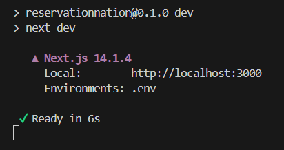

# Room Wrangler

## Abstract
A centralized system for reserving classrooms/ study spaces on university campuses in order to improve upon the lack of organization on many campuses. In this case, Room Wrangler's current database only includes data for Davidson College.

This project is important for Davidson College since Davidson's current system has inconsistencies and requires different communication and approval channels. Room Wrangler attempts to solve these problems and provide instant reservations without the requirment of a middle man (unless absolutely necessary).

## Requirements
- Node.js
- Mongo DB
- Prisma
- Next.js

### How to Install
- Find instructions to install Node JS [here](https://nodejs.org/en/learn/getting-started/how-to-install-nodejs).
- Find instructions to set up Mongo DB on your device or remotely [here](https://www.mongodb.com/docs/manual/tutorial/getting-started/).
- For extra assistance, this [tutorial](https://www.youtube.com/watch?v=c_-b_isI4vg&t=3081s&ab_channel=CodeWithAntonio) goes over the project set up in detail.

### Running the Product
1. Clone/ fork this Git repository. 
2. View the repository in your preferred IDE. 
3. Modify the Mongo DB connection strings anywhere in the code with your own username and password to your own database.
   - Connection String example: ``` "mongodb+srv://<USER>:<PASSWORD>@mongoverse.oyw8geb.mongodb.net/RoomWrangler" ```
   - Find instructions to set up your connection string [here](https://www.mongodb.com/resources/products/fundamentals/mongodb-connection-string). 

4. Assuming Node JS is already installed, run the following commands in the terminal:
   - ```npm i next@latest ``` (installs latest Next.js support required for the app)
   - ```npm prisma db push``` (sets and syncs up database using Prisma)
   - ```npm run dev``` (runs the project)
5. When the last command is executed, the code is compiled and the console looks similar to the following:
    
6. Click on the local host link provided if your browser does not launch automatically. This will open the website in your default browser.
7. The app can now be used in your browser! 

### Group Members
- Connor Cross '25 [@cocross1](https://github.com/cocross1)
- Kate Hynes '24 [@katehynes](https://github.com/katehynes)
- Rachel Massa '26 [@ramassa8](https://github.com/ramassa8)
- Yumna Ahmed '25 [@yuahmed](https://github.com/yuahmed)

